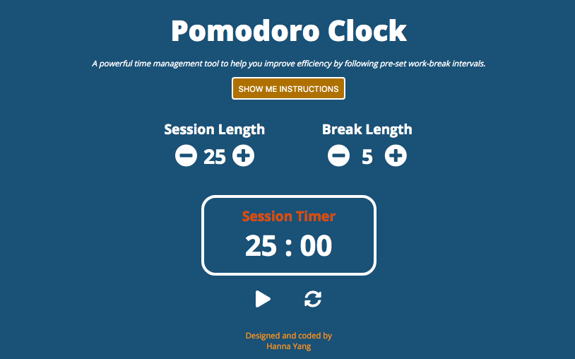

# React Pomodoro Clock
This project is to fulfill freeCodeCamp Front End Libraries certification Project 5: https://learn.freecodecamp.org/front-end-libraries/front-end-libraries-projects/build-a-pomodoro-clock

[](screenshot)

## Library used

- React

## How to run: 
```
npm install 
npm start
```